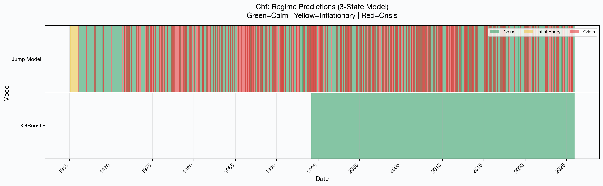
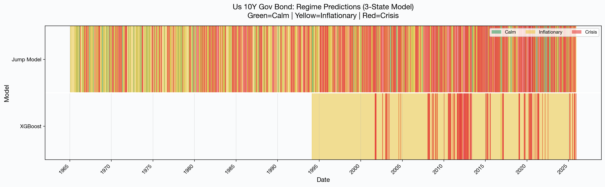
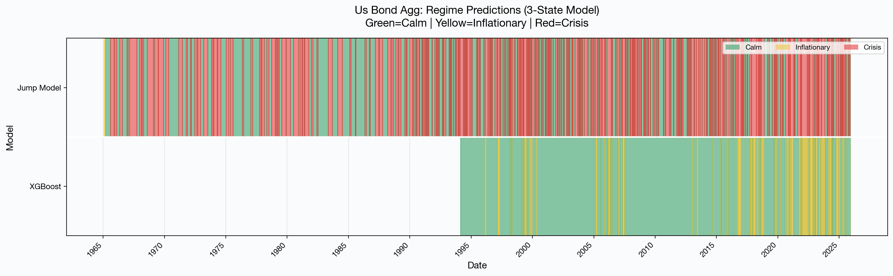
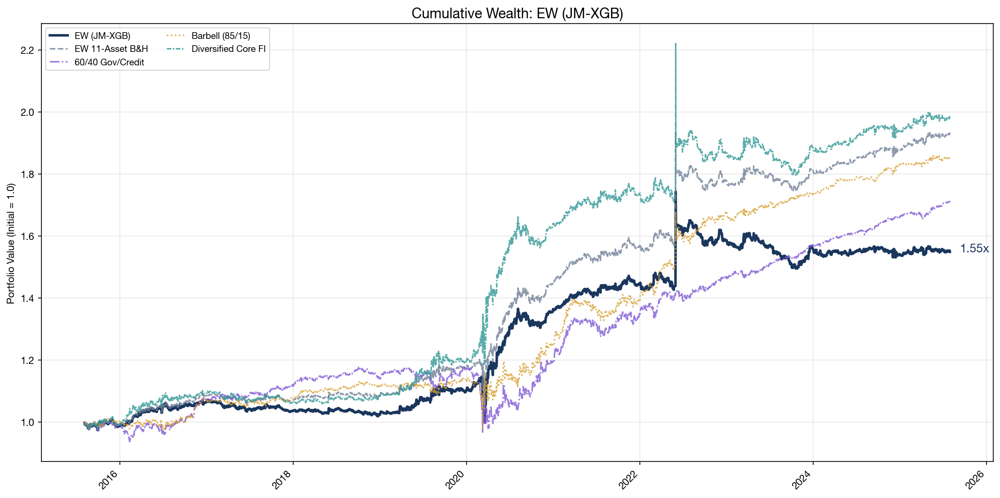
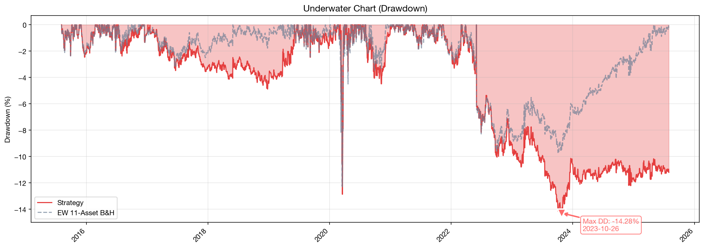
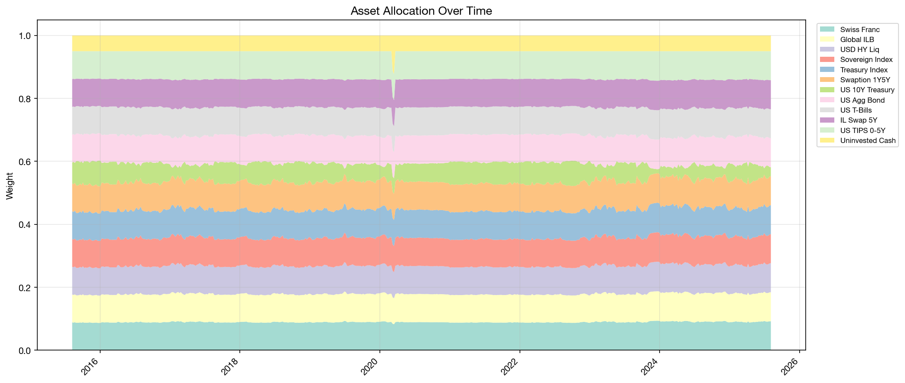
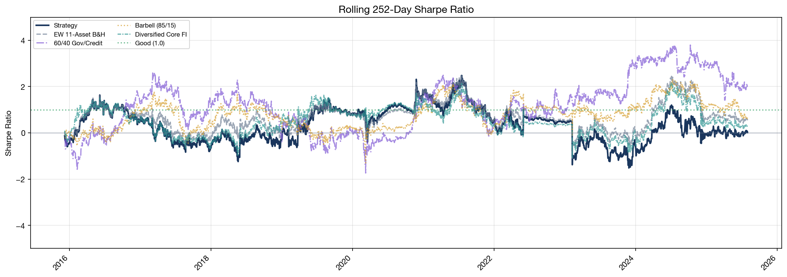
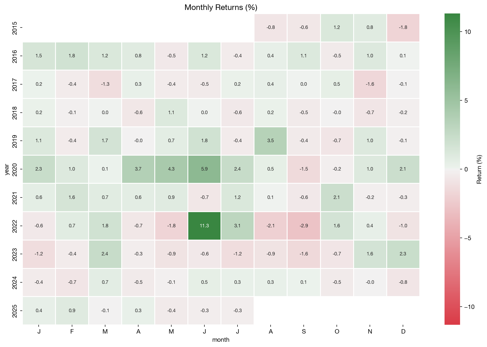
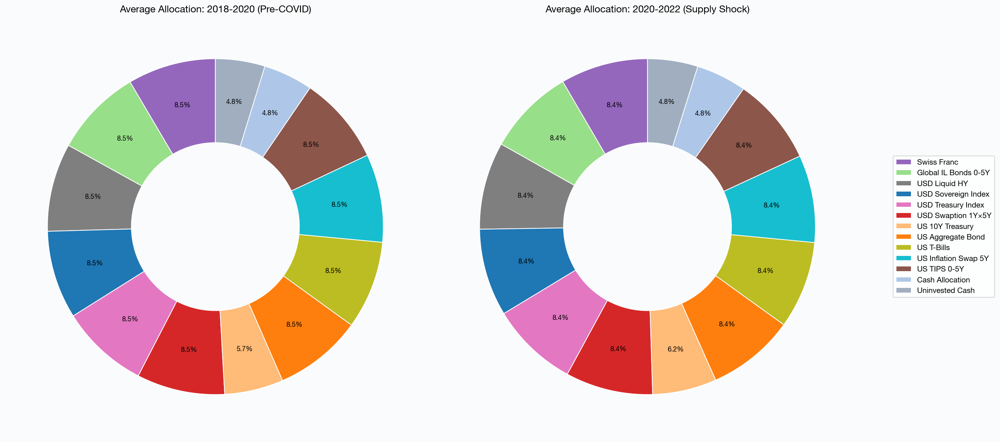
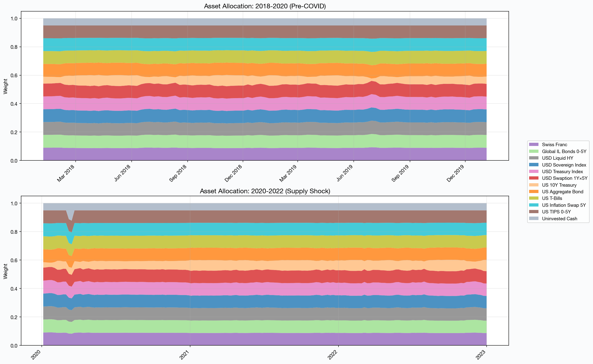

<p align="center">
  
</p>

<h1 align="center">FIOracle</h1>

<p align="center">
  <strong>Regime-Aware Fixed Income Oracle</strong>
</p>

<p align="center">
  <sub>
    <em>Kartik Yadav · Leon Förch · Edward Kachatryan · Nicola Copetti · Alessandro Florentino</em>
  </sub>
</p>

<br/>

<p align="center">
  <em>A machine learning framework for dynamic fixed income portfolio allocation that identifies market regimes and adapts positioning to navigate calm, inflationary, and crisis environments.</em>
</p>

<p align="center">
  <a href="#architecture">Architecture</a> •
  <a href="#results">Results</a> •
  <a href="#usage">Usage</a> •
  <a href="#config-manual">Config Manual</a> •
  <a href="#limitations">Limitations</a>
</p>

---

## Overview

FIOracle is a quantitative research framework that combines unsupervised regime detection with supervised regime forecasting to dynamically allocate across a universe of fixed income and safe-haven assets. The system employs a three-layer architecture:

```
┌─────────────────────────────────────────────────────────────────────────────┐
│                        FIOracle Architecture                                │
├─────────────────────────────────────────────────────────────────────────────┤
│                                                                             │
│   ┌─────────────────┐    ┌──────────────────┐    ┌────────────────────┐    │
│   │  LAYER A        │    │  LAYER B         │    │  LAYER C           │    │
│   │  Data Pipeline  │───▶│  Regime Engine   │───▶│  Portfolio Engine  │    │
│   └─────────────────┘    └──────────────────┘    └────────────────────┘    │
│           │                       │                        │                │
│     Asset Returns          Jump Model +              MVO / MinVar /         │
│     Macro Features         XGBoost Forecast          Equal Weight           │
│     Forward-Filled         3-State Regimes           Regime-Conditioned     │
│                                                                             │
└─────────────────────────────────────────────────────────────────────────────┘
```

### Asset Universe

| Category | Assets |
|----------|--------|
| **Cash & T-Bills** | US T-Bills |
| **Government Bonds** | US 10Y Treasury, Treasury Index, Sovereign Index |
| **Investment Grade** | US Aggregate Bond, Corporate IG |
| **High Yield** | CDX HY 5Y, USD Liquid HY |
| **Inflation Protection** | US TIPS 0-5Y, Inflation Swaps (1Y, 2Y, 5Y, 10Y) |
| **Safe Havens** | Gold, Swiss Franc (CHF) |
| **Commodities** | WTI Crude Oil |

### Macro Indicators

- **VIX** (Market Volatility)
- **GPRI** (Geopolitical Risk Index)
- **US Inflation Rate** (CPI)
- **US Debt-to-GDP Ratio**
- **US High Yield OAS** (Credit Spreads)
- **Economic Policy Uncertainty** (EPU)

---

<h2 id="architecture">Architecture Deep Dive</h2>

### 1. Jump Model (Unsupervised Regime Detection)

The foundation of regime identification uses a **Jump Model** (L1-regularized Markov-switching model) that partitions historical returns into three states:

- **Calm (State 0)**: Low volatility, positive expected returns
- **Inflationary (State 1)**: Elevated uncertainty, mixed returns
- **Crisis (State 2)**: High volatility, negative expected returns

The regularization parameter λ controls regime persistence vs. responsiveness, tuned via time-series cross-validation on the training set.

### 2. XGBoost Regime Forecaster (Supervised Learning)

A gradient-boosted classifier predicts tomorrow's regime using today's features:

**Defenses Against Overfitting:**
- `max_depth=5` limits tree complexity
- `subsample=0.8` and `colsample_bytree=0.8` introduce randomness
- `early_stopping_rounds` prevents excessive iterations
- Stratified time-series cross-validation (5-fold)
- Hyperparameter grid search on validation set only

**Defenses Against Look-Ahead Bias:**
- **Strict temporal separation**: Training (1945-2004), Validation (2005-2007), Test (2008-2025)
- **Publication lag modeling**: All macro indicators are lagged by their real-world reporting delays (e.g., CPI: 15 days, GDP: 90 days, VIX: 1 day)
- **Walk-forward architecture**: Models trained only on data available at each decision point
- **No future information leakage**: Features computed with causal-only operations (e.g., trailing rolling windows, not centered)

**Historical Regime Detection**

*The model correctly identifies crisis periods (red) during major market dislocations—GFC, COVID, rate shocks—while distinguishing calmer regimes (green) and inflationary episodes (yellow).*







### 3. Portfolio Optimization

Three strategies execute regime-conditioned allocations:

| Strategy | Objective | Risk Profile |
|----------|-----------|--------------|
| **MinVar** | Minimize portfolio variance | Conservative |
| **MVO** | Maximize Sharpe (risk-adjusted returns) | Balanced |
| **EW** | Equal-weight bullish assets | Aggressive |

**Regime-Specific Behavior:**
- **Crisis detected**: Rotate to cash, Treasuries, Gold, CHF
- **Inflationary**: Favor TIPS, commodities, reduce duration
- **Calm**: Full diversification across credit, rates, alternatives

---

<h2 id="results">Results</h2>

### Out-of-Sample Performance (2008–2025)

The test period spans 17+ years and includes multiple stress events: Global Financial Crisis (2008), European Debt Crisis (2011), COVID Crash (2020), and the 2022 Rate Shock.

| Metric | EW | MVO |
|--------|----|----|
| **Sharpe Ratio** | 0.39 | 0.37 |
| **Total Return** | 54.8% | 53.1% |
| **Calmar Ratio** | 0.21 | 0.31 |

### Cumulative Wealth Growth

The regime-aware strategies successfully navigated multiple crisis periods while maintaining steady growth:



### Drawdown Analysis

Our strategies demonstrated strong downside protection during volatile periods:



### Dynamic Allocation

The model dynamically shifts allocation based on detected market regimes:



### Rolling Sharpe Ratio

Consistent risk-adjusted performance across market cycles:



### Monthly Returns Heatmap



### Supply Shock Period Analysis (2018–2022)

The model adapted allocations during the COVID crash and subsequent supply shock period:





---

<h2 id="usage">Usage Guide</h2>

### Installation

```bash
# Clone repository
git clone https://github.com/your-org/fioracle.git
cd fioracle

# Create virtual environment
python -m venv .venv
source .venv/bin/activate  # Linux/Mac
# .venv\Scripts\activate  # Windows

# Install dependencies
pip install -r requirements.txt
```

### Quick Start

```bash
# Run full pipeline (quick mode for testing)
python main.py --quick

# Run full pipeline (all data, 1945-present)
python main.py
```

### Adding New Assets

1. Place CSV file in `asset_universe/` with columns: `Date`, `Value` (or similar)
2. Add filename (without `.csv`) to `config/config.yaml` under `assets.investable`
3. Run pipeline—the system auto-detects column formats

### Output Structure

```
output/
├── figures/
│   ├── test/
│   │   ├── mv/                    # Mean-Variance strategy plots
│   │   ├── minvar/                # Minimum Variance plots
│   │   ├── ew/                    # Equal Weight plots
│   │   ├── vix_analysis/          # VIX effectiveness analysis
│   │   ├── supply_shock_analysis/ # 2018-2022 period analysis
│   │   └── advanced_analytics/    # Fat-tail and statistical tests
│   ├── historical/                # Long-term time series
│   └── regime_analysis/           # Macro indicator timelines
├── results/
│   ├── pipeline_summary.json      # Aggregate results
│   └── test/
│       ├── strategy_comparison.json
│       └── {strategy}/benchmark_comparison.csv
└── regime_statistics/             # Regime distributions
```

---

<h2 id="config-manual">Configuration Manual</h2>

All settings live in `config/config.yaml`. Key sections:

| Section | What It Controls |
|---------|------------------|
| `data` | Train/val/test date splits, data directories |
| `assets` | Which assets to trade, categories, display names |
| `macro` | Enabled macro indicators and smoothing params |
| `macro_lags` | Publication delays to prevent look-ahead bias |
| `regimes` | Jump Model λ, XGBoost hyperparameters, state count |
| `portfolio` | Risk aversion, max weights, transaction costs |

### Adding a New Asset

1. Drop `MY_ASSET.csv` into `asset_universe/`
2. Add `MY_ASSET` to `assets.investable` in config
3. Run the pipeline

### Key Parameters

```yaml
# Date splits
data:
  train_end: 2004-12-31
  val_end: 2007-12-31
  test_start: 2008-01-01

# Regime detection
regimes:
  jump_model:
    n_states: 3              # calm / inflationary / crisis
    default_lambda: 5.0
  xgboost:
    max_depth: 5
    subsample: 0.8

# Portfolio
portfolio:
  gamma_risk: 10.0           # Higher = more conservative
  max_weight: 0.40           # Max single-asset allocation
  transaction_cost: 0.0005   # 5 bps
```

### Quick Recipes

| Goal | Changes |
|------|--------|
| **Conservative** | `gamma_risk: 15`, `max_weight: 0.25` |
| **Aggressive** | `gamma_risk: 5`, `max_weight: 0.50` |
| **Fast dev runs** | `train_start: 2000-01-01`, `tune_hyperparameters: false` |

---

<h2 id="limitations">Limitations</h2>

- **Regime lag**: Crisis signals may arrive 1–3 days after drawdowns begin
- **Long-only**: No shorting; defense = rotate to cash/safe havens
- **USD only**: FX hedging not modeled
- **Fixed costs**: Assumes 5 bps; real spreads vary by instrument

---

## Citation

If you use FIOracle in your research, please cite:

```bibtex
@software{fioracle2025,
  title={FIOracle: Regime-Aware Fixed Income Portfolio Optimization},
  author={Yadav, Kartik and Förch, Leon and Kachatryan, Edward and Copetti, Nicola and Florentino, Alessandro},
  year={2025},
  url={https://github.com/your-org/fioracle}
}
```

### Related Work

This project implements concepts from:

> Shu, Y., Yu, C., & Mulvey, J. M. (2024). *Dynamic Asset Allocation with Asset-Specific Regime Forecasts*. [arXiv:2406.09578](https://arxiv.org/abs/2406.09578)

---

## License

This project is licensed under the MIT License - see the [LICENSE](LICENSE) file for details.

---

<p align="center">
  <sub>Built with ❤️ for quantitative research</sub>
</p>
